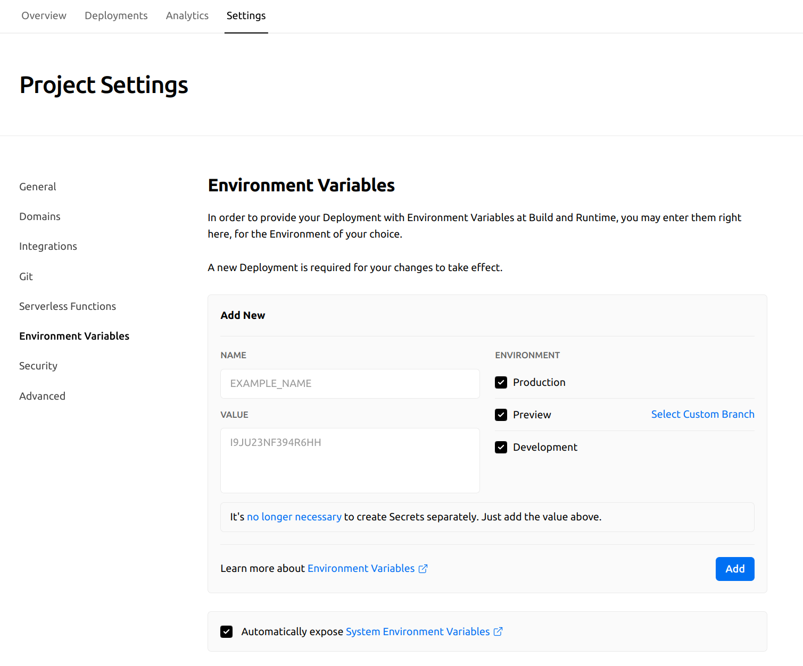

[![MIT License][license-shield]][license-url]
[![LinkedIn][linkedin-shield]][linkedin-url]

<div align="center"> 
  <h1 align="center">Robocooker</h1>

  <p align="center">
   Create your own cooking recipes for food processors
    <br />
    <br />
    <a href="https://github.com/ansango/robocooker/issues">Report a bug</a>
  </p>
</div>

<div id="top"></div>

<details>
  <summary>Table of Contents</summary>
  <ol>
    <li><a href="#about">Introduction</a></li>
    <li><a href="#getting-started">Getting Started</a></li>
    <li><a href="#structure">Structure</a></li>
    <li><a href="#frontend">Frontend</a></li>
    <li><a href="#backend">Backend</a></li>
    <li><a href="#environment-variables">Environment variables</a></li>
    <li><a href="#deploy">Deploy</a></li>
    <li><a href="#contributing">Contributing</a></li>
  </ol>
</details>

## Introduction

### About

This is the base repository of Robocooker, a food social network oriented to food robots.

It'is based on [Next.js](https://nextjs.org/).

## Getting Started

Download this project or clone:

```bash
git clone https://github.com/ansango/robocooker.git
```

and install the dependencies:

```bash
yarn install # or npm install
```

Then run in your terminal:

```bash
yarn dev # npm run dev
```

<p align="right"><a href="#top">back to top</a></p>

## Structure

The project is based in Next.js, so it has a structure similar to the one of Next.js. You have a `pages` folder, where you can create your pages, and inside this one you have an api folder with the API routes.
Lib folder contains the libraries services, and queries used by the project.

> Remember Nextjs is based on React and Express, so Frontend and Backend are ready configured.

Checkout the official [Next.js documentation](https://nextjs.org/docs) for more information.

```bash
├── components
│   ├── common
│   ├── dashboard
│   ├── layout
│   ├── pages
│   └── skeletons
├── lib
│   ├── api
│   ├── mocks
│   ├── models
│   ├── services
│   ├── store
│   └── utils
├── pages
│   ├── api
│   ├── blender
│   ├── category
│   ├── dashboard
│   ├── profile
│   ├── recipe
│   ├── recovery
│   └── verify
├── styles
└── types
```
<p align="right"> <a href="#top">back to top</a></p>

## Frontend

You can find the frontend in the `pages` folder, redux store in the `store` folder, and components in the `components` folder.

```bash
├── components
│   ├── common
│   ├── dashboard
│   ├── layout
│   ├── pages
│   └── skeletons
├── lib
│   ├── store
├── pages
│   ├── blender
│   ├── category
│   ├── dashboard
│   ├── profile
│   ├── recipe
│   ├── recovery
│   └── verify
└── styles
```

<p align="right"> <a href="#top">back to top</a></p>

## Backend

Next.js is based on Express.js, so you can find the backend in the `pages/api` folder. Libraries, configurations, and queries are in the `lib` folder.

```bash

├── lib
│   ├── api
│   │   ├── auth
│   │   ├── db
│   │   ├── issues
│   │   ├── mail
│   │   ├── middlewares
│   │   ├── nc
│   │   └── schemas
│   ├── services
└── pages
  └── api

```

<p align="right"> <a href="#top">back to top</a></p>

## Environment variables

We will proceed to configure the environment variables. Inside the project we will find an example file (.envexample) to configure the necessary environment variables to be able to have the project fully configured. We must rename it to .env.local to run in dev mode.

You should see something like this:

```bash
# .env.local
MONGODB_URI= # your mongodb uri

CLOUDINARY_CLOUD_NAME= # your cloudinary cloud name
CLOUDINARY_API_KEY= # your cloudinary api key
CLOUDINARY_API_SECRET= # your cloudinary api secret
WEB_URI= # your web uri
NEXT_PUBLIC_WEB_URI= # your web uri
NODEMAILER_PORT= # your nodemailer port
NODEMAILER_HOST= # your nodemailer host
NODEMAILER_USER= # your nodemailer user
NODEMAILER_PASS= # your nodemailer pass
NOTION_KEY= # your notion key
NOTION_DATABASE_ID= # your notion database id

```

This connects to the database, cloudinary service, Notion API, and nodemailer service.

<p align="right"><a href="#top">back to top</a></p>

## Deploy

The easiest way to deploy is to use the [Vercel Platform](https://vercel.com/).

Remember to configure the environment variables as in env.local but into settings at Vercel

[Check the official documentation](https://vercel.com/docs/concepts/projects/environment-variables).

<div align="center">
  
</div>

<p align="right"><a href="#top">back to top</a></p>

## Contributing

Contributions are what make the open source community such an amazing place to learn, inspire, and create. Any contributions you make are **greatly appreciated**.

If you have a suggestion that would make this better, please fork the repo and create a pull request. You can also simply open an issue with the tag "enhancement".
Don't forget to give the project a star! Thanks again!

1. Fork the Project
2. Create your Feature Branch (`git checkout -b feature/AmazingFeature`)
3. Commit your Changes (`git commit -m 'Add some AmazingFeature'`)
4. Push to the Branch (`git push origin feature/AmazingFeature`)
5. Open a Pull Request

<p align="right"><a href="#top">back to top</a></p>

> [Stars are welcome!](https://github.com/ansango/robocooker) ⭐⭐⭐

## License

Distributed under the MIT License. See [`LICENSE.txt`](https://github.com/ansango/robocooker/blob/main/LICENSE.txt) for more information.

<!-- MARKDOWN LINKS & IMAGES -->
<!-- https://www.markdownguide.org/basic-syntax/#reference-style-links -->

[license-shield]: https://img.shields.io/github/license/othneildrew/Best-README-Template.svg?style=for-the-badge
[license-url]: https://github.com/ansango/robocooker/blob/main/LICENSE.txt
[linkedin-shield]: https://img.shields.io/badge/-LinkedIn-black.svg?style=for-the-badge&logo=linkedin&colorB=555
[linkedin-url]: https://linkedin.com/in/ansango
