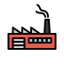
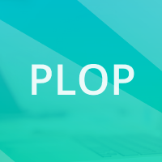
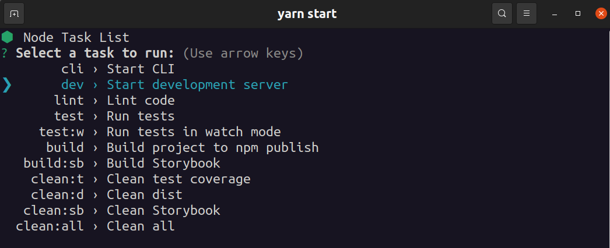
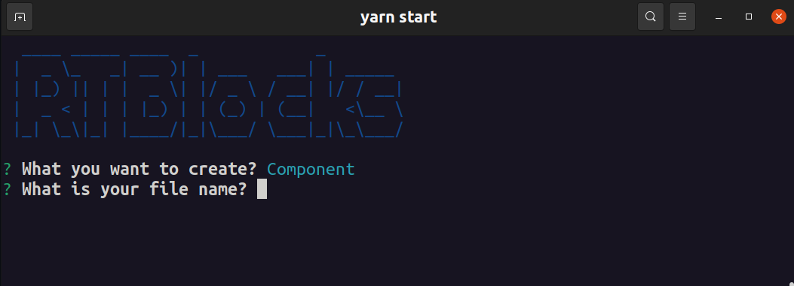
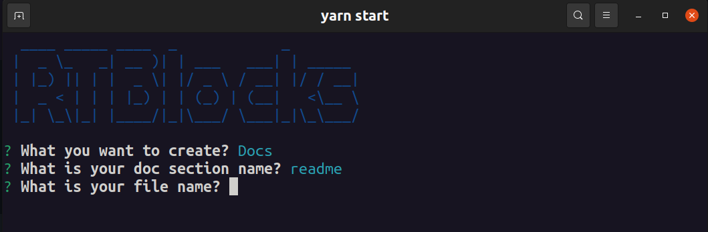
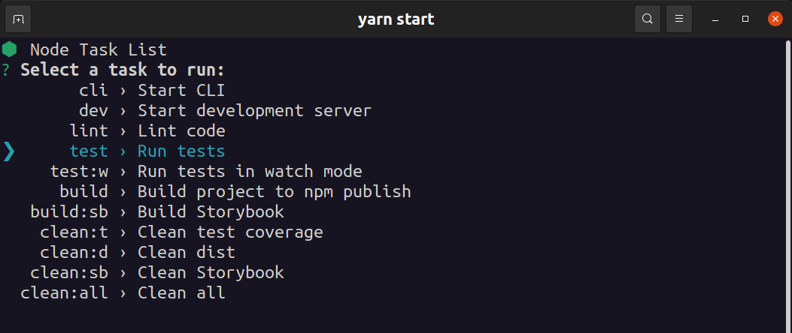
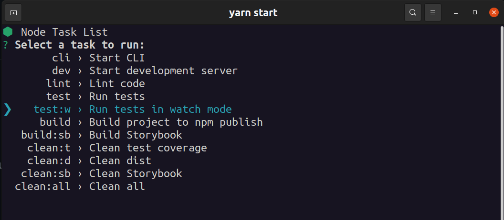
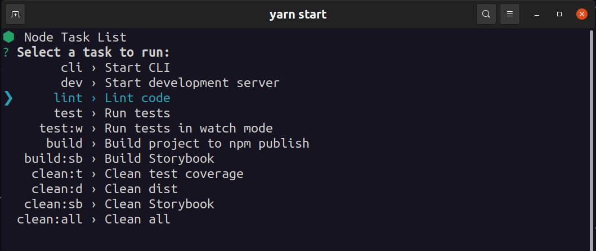
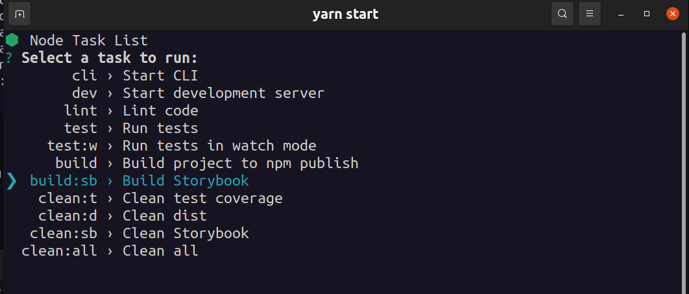
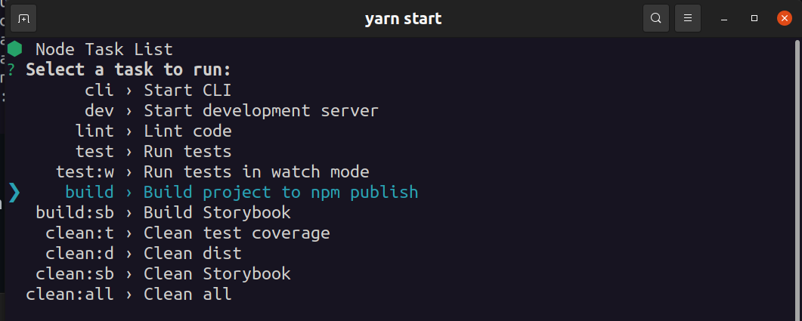

Generate UI Component libraries with **React** and **Tailwindcss**

[![MIT License][license-shield]][license-url]
[![LinkedIn][linkedin-shield]][linkedin-url]

<div align="center">
 <a href="https://github.com/ansango/rtb-starter">
    
  </a>
  <h1 align="center">React Tailwind Blocks - Starter</h1>

  <p align="center">
    Generate UI Component libraries with
    <a href="https://reactjs.org/">React</a>
    <br />
    <br />
    <a href="https://github.com/ansango/rtb-starter/issues">Report a bug</a>
  </p>
</div>

<div id="top"></div>

<details>
  <summary>Table of Contents</summary>
  <ol>
    <li><a href="#about">Introduction</a></li>
    <li><a href="#getting-started">Getting Started</a></li>
    <li><a href="#create-a-component">Create a Component</a></li>
    <li><a href="#test-and-lint">Test and Lint</a></li>
    <li><a href="#build-deploy-and-install-your-package">Build, deploy and install your package</a></li>
    <li><a href="#contributing">Contributing</a></li>
  </ol>
</details>

## Introduction

### About

This project has been created to generate component libraries in [React](https://reactjs.org/).

It is based on [React](https://reactjs.org/), [Tailwindcss](https://tailwindcss.com/), and [Storybook](https://storybook.js.org/). With this starter you can start writing isolated and tested components, ready to publish and consume as packages in [npm](https://www.npmjs.com/).

> The Storybook is **[here](https://rtb-starter.vercel.app/)**

> The demo package is published in **[npm](https://www.npmjs.com/package/rtb-starter)**

### Built with

<div style="display:flex; align-items:center; flex:wrap;">
  <a href="https://reactjs.org/" target="_blank" style="padding:0 5px 0 5px; text-align:center">
    
  </a>
  
  <a href="https://www.typescriptlang.org/" target="_blank" style="padding:0 5px 0 5px; text-align:center;">
    
  </a>
  <a href="https://tailwindcss.com/" target="_blank" style="padding:0 5px 0 5px; text-align:center;">
    
  </a>
  <a href="https://storybook.js.org/" target="_blank" style="padding:0 5px 0 5px; text-align:center">
    
  </a>
  <a href="https://jestjs.io/" target="_blank" style="padding:0 5px 0 5px; text-align:center">
    
  </a>
  <a
    href="https://testing-library.com/docs/react-testing-library/intro/"
    target="_blank"
    style="padding:0 5px 0 5px; text-align:center">
    
  </a>
  <a href="https://eslint.org/" target="_blank" style="padding:0 5px 0 5px; text-align:center">
    
  </a>
  <a href="https://prettier.io/" target="_blank" style="padding:0 5px 0 5px; text-align:center">
    
  </a>
  <a href="https://rollupjs.org/guide/en/" target="_blank" style="padding:0 5px 0 5px; text-align:center">
    
  </a>
  <a href="https://plopjs.com/" target="_blank" style="padding:0 5px 0 5px; text-align:center">
  
  </a>

  <a href="https://typicode.github.io/husky/" target="_blank" style="padding:0 5px 0 5px; text-align:center">
    
  </a>
</div>

## Getting Started

Use Github templete or:

```bash
git clone https://github.com/ansango/rtb-starter.git
```

and install the dependencies:

```bash
yarn install # or npm install
```

Then run in your terminal:

```bash
yarn start # npm start
```

> This runs a script manager, then you can choose what you want to do. 😄

<div align="center">
  
</div>

> ⚠️ The CLI works fine in **`bash`**, but in **`powershell`** the arrows do not allow you to select anything, so you will have to create the files manually. **[This is a bug in the Node core on Windows](https://github.com/SBoudrias/Inquirer.js/issues/793).**


<p align="right"><a href="#top">back to top</a></p>

## Create a Component

Open your terminal and run:

```bash
 yarn cli # or select "cli" option in the Script Manager
```

With the CLI you can choose what you want to create, choose a component and type a name:

<div align="center">
  
</div>

> This generates template files to coding a component. You will find all the files in `src/components` folder. Your component folder contains:

- `Component.tsx` file:

```jsx
import { FC } from "react";
import * as cn from "./SampleComponentStyles";

export type SampleComponentProps = {
  /**
   * Description of options in Storybook
   */
  option?: "option__one" | "option__two" | "option__three",
  /**
   * Optional click handler
   */
  onClick?: () => void,
  /**
   * Class Name override
   */
  className?: string,
};

/**
 * Description of SampleComponent component displayed in Storybook
 */

const SampleComponent: FC<SampleComponentProps> = ({
  option = "option__one",
  className,
  ...props
}) => {
  const cnOption = cn.options[option];
  const styles = className ?? cnOption;
  return (
    <div className={styles} {...props}>
      <span>SampleComponent</span>
    </div>
  );
};

export default SampleComponent;
```

- `ComponentStyle.ts` file, to write Tailwind classes as blocks:

```js
/**
 ** Write your tailwind classes as objects and strings and import them in your component
 */

export const options = {
  option__one: "bg-red-500 text-white font-bold py-2 px-4 rounded max-w-xs cursor-pointer",
  option__two: "bg-green-500 text-white font-bold py-2 px-4 rounded max-w-sm cursor-pointer",
  option__three: "bg-blue-500 text-white font-bold py-2 px-4 rounded max-w-md cursor-pointer",
};
```

- `Component.test.tsx` file, to testing your component:

```jsx
/**
 *? SampleComponent Test
 */

import { render, screen } from "@testing-library/react";

import SampleComponent from "./SampleComponent";

describe("<SampleComponent />", () => {
  it("should render", () => {
    render(<SampleComponent />);
    expect(screen.getByText("SampleComponent")).toBeInTheDocument();
  });
});
```

- `Componente.stories.tsx` file to write your Storybook component:

```jsx
/**
 * ? SampleComponent Story
 */

import { ComponentStory, ComponentMeta } from "@storybook/react";
import SampleComponent from "./SampleComponent";

export default {
  title: 'Samples/SampleComponent',
  component: SampleComponent,
} as ComponentMeta<typeof SampleComponent>;

const Template: ComponentStory<typeof SampleComponent> = (args) => <SampleComponent {...args} />;

export const OptionOne = Template.bind({});

OptionOne.args = {
  option: "option__one",
};

export const CustomClass = Template.bind({});

CustomClass.args = {
  className: "bg-yellow-500 text-white font-bold py-2 px-4 rounded max-w-lg cursor-pointer",
};
```

<p align="right"><a href="#top">back to top</a></p>

### Create plain Docs pages

Storybook supports .mdx files, so we will create our flat documentation this way. To do this we go back to our CLI and select the docs option. Type a section and a name and that's all 😄

<div align="center">
  
</div>

> This generates template file write "plain" docs as Markdown files. You will find all the files in `src/docs` folder. Your doc file contains:

```md
import { Meta } from "@storybook/addon-docs";

<Meta title="Sample/Sample" />import { Meta } from "@storybook/addon-docs";

# Sample

...
```

<p align="right"><a href="#top">back to top</a></p>

## Test and Lint

You can run tests:

<div align="center">
  
</div>

Or you can also run unit tests in **watch mode**:

<div align="center">
  
</div>

You can run lint, [ESLint](https://eslint.org/):

<div align="center">
  
</div>

> Before you can commit to your repository [ESLint](https://eslint.org/) and all tests will be run, if they fail [Husky](https://typicode.github.io/husky/#/) will not let you commit.

<p align="right"><a href="#top">back to top</a></p>

## Build, deploy and install your package

### Build and deploy your Storybook

It's easy, to compile your Storybook in **`/storybook-static` folder** run:

<div align="center">
  
</div>

> Easy to do at [Vercel](https://vercel.com/).

<p align="right"><a href="#top">back to top</a></p>

### Build and publish your library

Build runs by [Rollup](https://rollupjs.org/) and its entry point is `src/index.ts` file.

Please make sure that **all your components** are being imported and exported in this file.

```js
// src/index.ts

import Button from "./components/Button/Button";
export { Button };
```

Then **run**:

<div align="center">
  
</div>

> You can find the bundle in **`/dist` folder** to be published at [npm](https://docs.npmjs.com/cli/v8/commands/npm-publish)

> To publish run `npm publish` (after login `npm login`)

<p align="right"><a href="#top">back to top</a></p>

### Install your own library

Simple, install it!

```bash
yarn add {awesome-library} # or npm i {awesome-library}
```

Because we use Tailwindcss, we have to install and configure it. [Read the docs](https://tailwindcss.com/docs/installation).

You have to add the following in your `tailwind.config.js`:

```js
module.exports = {
  content: [
    "./components/**/*.{html,js}",
    "./pages/**/*.{html,js}",
    "./node_modules/awesome-library/dist/**/*.{js,ts,jsx,tsx}",
  ],
  // ...
};
```

> [See more](https://tailwindcss.com/docs/content-configuration#working-with-third-party-libraries)

These are current `peerDependencies` you must be in your new project (`package.json`):

```json
{
  "dependencies": {
    "postcss": "^8.4.5",
    "react": "^17.0.2",
    "react-dom": "^17.0.2"
  },
  "devDependencies": {
    "tailwindcss": "^3.0.16"
  }
}
```

If you have problems, please open an [issue](https://github.com/ansango/rtb-starter/issues)

<p align="right"><a href="#top">back to top</a></p>

## Contributing

Contributions are what make the open source community such an amazing place to learn, inspire, and create. Any contributions you make are **greatly appreciated**.

If you have a suggestion that would make this better, please fork the repo and create a pull request. You can also simply open an issue with the tag "enhancement".
Don't forget to give the project a star! Thanks again!

1. Fork the Project
2. Create your Feature Branch (`git checkout -b feature/AmazingFeature`)
3. Commit your Changes (`git commit -m 'Add some AmazingFeature'`)
4. Push to the Branch (`git push origin feature/AmazingFeature`)
5. Open a Pull Request

<p align="right"><a href="#top">back to top</a></p>

> [Stars are welcome!](https://github.com/ansango/rtb-starter) ⭐⭐⭐

## License

Distributed under the MIT License. See [`LICENSE.txt`](https://github.com/ansango/rtb-starter/blob/main/LICENSE.txt) for more information.

<!-- MARKDOWN LINKS & IMAGES -->
<!-- https://www.markdownguide.org/basic-syntax/#reference-style-links -->

[license-shield]: https://img.shields.io/github/license/othneildrew/Best-README-Template.svg?style=for-the-badge
[license-url]: https://github.com/ansango/rtb-starter/blob/main/LICENSE.txt
[linkedin-shield]: https://img.shields.io/badge/-LinkedIn-black.svg?style=for-the-badge&logo=linkedin&colorB=555
[linkedin-url]: https://linkedin.com/in/ansango
